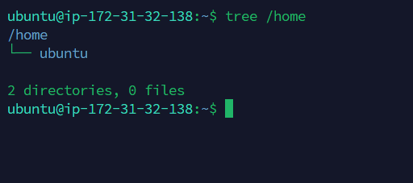
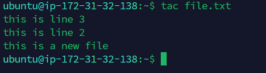
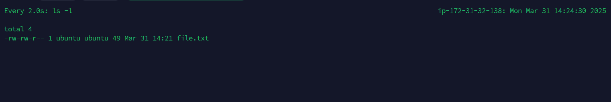
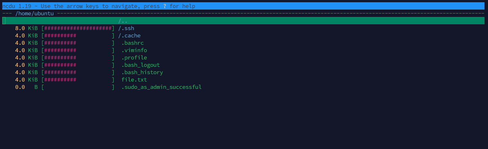
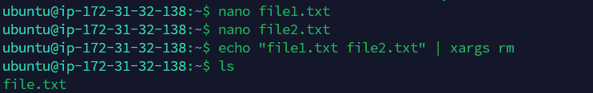
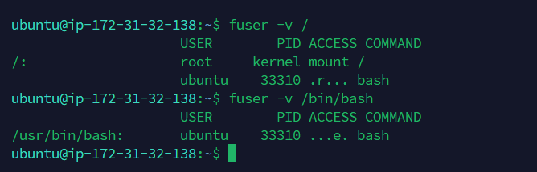
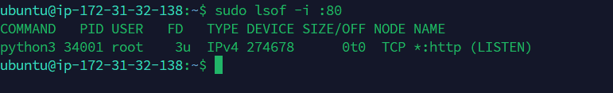
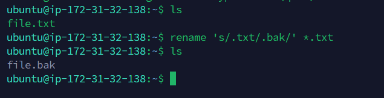
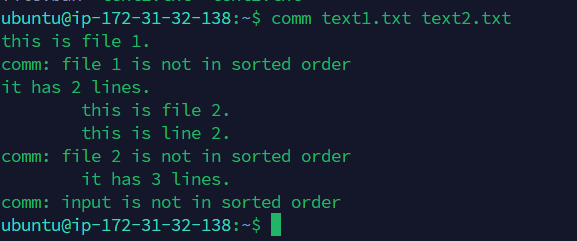
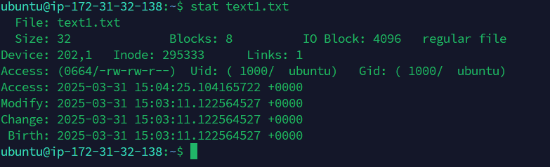

# Linux Commands Documentation

## 1. tree
**Description:** The `tree` command displays the directory structure in a tree-like format.

**Example:**
```sh
tree /home
```
**Screenshot:**  


---

## 2. tac
**Description:** The `tac` command displays a file's contents in reverse order.

**Example:**
```sh
tac file.txt
```
**Screenshot:**  


---

## 3. watch
**Description:** The `watch` command runs a command periodically and displays its output.

**Example:**
```sh
watch -n 2 ls -l
```
**Screenshot:**  


---

## 4. ncdu
**Description:** The `ncdu` command provides a visual representation of disk usage.

**Example:**
```sh
ncdu /home
```
**Screenshot:**  


---

## 5. xargs
**Description:** The `xargs` command builds and executes commands from standard input.

**Example:**
```sh
echo "file1.txt file2.txt" | xargs rm
```
**Screenshot:**  


---

## 6. fuser
**Description:** The `fuser` command identifies processes using a file or directory.

**Example:**
```sh
fuser /var/log/syslog
```
**Screenshot:**  


---

## 7. lsof
**Description:** The `lsof` command lists open files and the processes using them.

**Example:**
```sh
lsof -i :80
```
**Screenshot:**  


---

## 8. rename
**Description:** The `rename` command renames multiple files at once.

**Example:**
```sh
rename 's/.txt/.bak/' *.txt
```
**Screenshot:**  


---

## 9. comm
**Description:** The `comm` command compares two sorted files line by line.

**Example:**
```sh
comm file1.txt file2.txt
```
**Screenshot:**  


---

## 10. stat
**Description:** The `stat` command displays detailed information about a file.

**Example:**
```sh
stat file.txt
```
**Screenshot:**  


---
