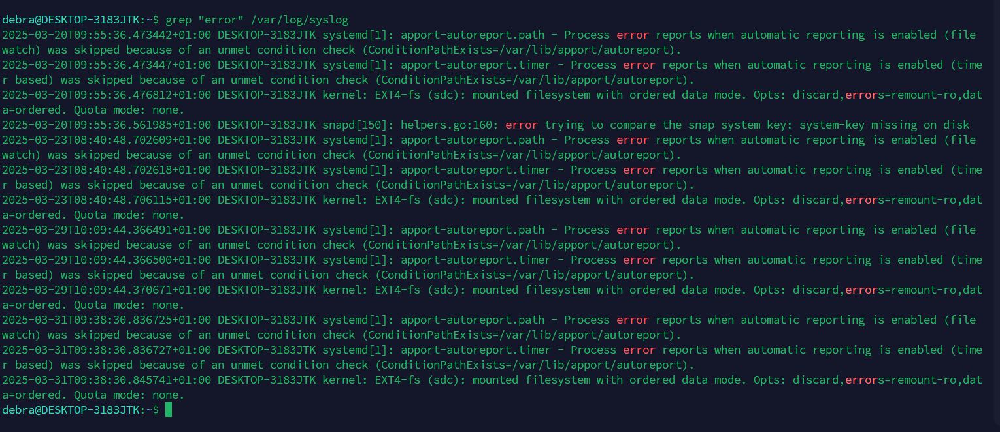

# Linux Commands Documentation

## 1. grep
**Description:** `grep` is used to search for a pattern in a file.

**Example:**
```sh
grep "error" /var/log/syslog
```

This searches for the word "error" in the system log file.


